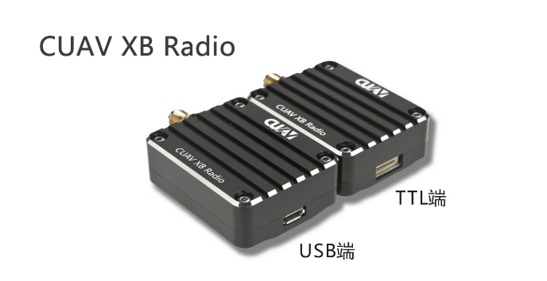

## CUAV XBEE  Over the horizon data transmission module

## Summarize {#概述}

---

CUAV XBEE Radio is a high-power, high-speed, high-reception sensitivity data transmission module

It has a built-in S3B RF module from the United States DIGI company, transmitting power up to 250mW, ISM 900MHZ legal frequency, supporting a variety of advanced network options and topology modes

The CUAV XBEE Radio module offers an unprecedented range of low-cost wireless data solutions. This module is easy to use and is especially suitable for unmanned unit networks and point-to-point over-the-horizon transmission, providing stable, critical data transmission between drones and equipment. Their small size saves valuable on-board space.

## Characteristic

---

#### Ultra high receiving sensitivity

Highest -110dBm Receiver Sensitivity in Low Rate Mode

### Long distance

The low-speed mode supports up to 14km \*\*\*\*\*.

### High speed

Up to 200k air speed

### CNC integrated shell

Aerospace aluminum alloy one-piece CNC housing, lightweight, strong, beautiful and anti-jamming

## Parameter {#参数}

---

|  | CUAV®  xbee |
| :--- | :--- |
| hardware |  |
| frequency range | 902 ~ 928 MHz |
| processor | ADF7023 transceiver，Cortex-X3 EFM32G230@28Mhz |
|  | Programmers include：Freescale MC9s08QE32 |
| Antenna selection | wire.U.FlL and RPSMSA |
| function |  |
| data rate | 10kbps/200Kbps（De acuerdo con diferentes tasas de firmware,，tacitly approve 200k\) |
| Urban / indoor distance | 10kbps: Up to 2000 feet \(610 meters\); 200kbps: Up to 1000 feet |
| Outdoor/Suburban Distance | 10kbps: up to 15.5km 200kps: up to 6.5k meters |
| Maximum power | 24dBM \(250mw\) software optional |
| Receiver sensitivity | -101dBM@200Kpds ;-110dBm@10kbps |
| characteristic |  |
| Data interface | UART\(3V）.SPI |
| GPIO | 15 digital iO, 4 10-bit ADC inputs, 2 PWM outputs |
| Network Topology | DIgiMEsh, relay, point-to-point, point-to-multipoint, peer-to-peer network |
|  | Spread spectrumFHSS \(software optional\) |
| Programmability |  |
| internal storage | 32kb FLASH/2kb RAM |
|  | CPU clockUp to 50MHZ |
| power |  |
| service voltage | 4-7v |
| Emission current | 229mA |
| Receive current | 44ma |
| Sleep current | 3uA |
| Management agency certification |  |
| FCC（America） | MCQ-XB900HP |
| iC（Canada） | 1846A—XB900HP |
| C-tick\(Australia） | yes |
| Anatel（Brazil） | yes |
| IDA（Singapore） | yes |

